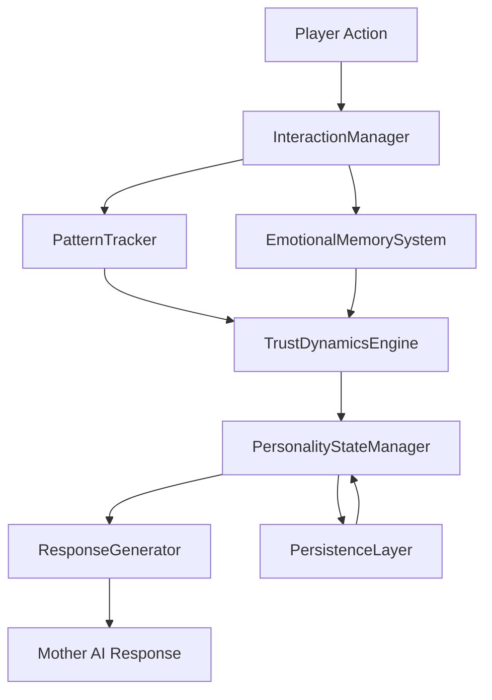
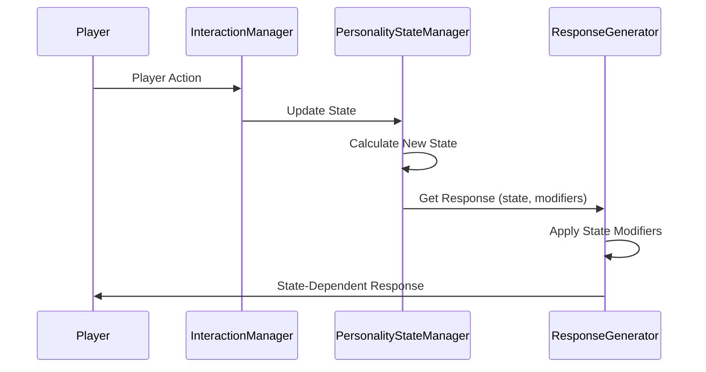

# Design Document: Mother AI Personality System

## Overview

The Mother AI Personality System transforms the existing AI parent implementation from a simple reaction-based model to a sophisticated pattern-recognition and emotional memory system. The design emphasizes realistic relationship dynamics where trust builds slowly through consistent behavior, resentment accumulates quietly rather than explosively, and emotional distance manifests through subtle behavioral changes rather than dramatic confrontations.

The system integrates with the existing `AIParent` architecture while introducing new subsystems for pattern tracking, emotional memory, trust dynamics, and state-dependent response generation. The core philosophy is that relationships are shaped by patterns over time, not individual incidents, and that emotional authenticity comes from remembering how interactions felt rather than what was said.

## Architecture

### High-Level Architecture



### Component Relationships

The system extends the existing `AIParent` class with new subsystems:

1. **PatternTracker**: Monitors sequences of player actions over time windows
2. **EmotionalMemorySystem**: Stores emotional impact of interactions with contextual metadata
3. **TrustDynamicsEngine**: Manages trust score, resentment score, and derived states
4. **PersonalityStateManager**: Coordinates all personality metrics and determines current state
5. **ResponseGenerator**: Produces state-dependent responses based on personality state
6. **PersistenceLayer**: Handles serialization and restoration of all personality state

### Integration with Existing Systems

- **AIParent**: Extended with new personality subsystems
- **PersonalityProfile**: Augmented with dynamic trust and resentment metrics
- **EmotionalState**: Enhanced to include withdrawal states and emotional safety
- **LearningSystem**: Integrated with PatternTracker for behavioral pattern detection
- **InteractionManager**: Modified to route actions through pattern and memory systems
- **MemoryStore**: Extended to support emotional memory storage format

## Components and Interfaces

### 1. PatternTracker

**Purpose**: Detects and tracks behavioral patterns over time to enable pattern-based responses.

**Interface**:
```python
class PatternTracker:
    def record_action(self, action: PlayerAction, timestamp: datetime) -> None:
        """Record a player action with timestamp for pattern analysis."""
        
    def detect_patterns(self, time_window: timedelta) -> List[BehaviorPattern]:
        """Identify repeated behavioral patterns within time window."""
        
    def get_pattern_frequency(self, pattern_type: PatternType) -> float:
        """Calculate frequency of specific pattern type."""
        
    def break_pattern(self, pattern_type: PatternType) -> None:
        """Mark a negative pattern as broken by positive behavior."""
        
    def get_pattern_weight(self, pattern_type: PatternType) -> float:
        """Get current weight of a pattern (decreases as pattern is broken)."""
```

**Key Data Structures**:
```python
@dataclass
class PlayerAction:
    action_type: ActionType
    context: ContextType  # PUBLIC or PRIVATE
    emotional_valence: float  # -1.0 to 1.0
    timestamp: datetime
    metadata: Dict[str, Any]

@dataclass
class BehaviorPattern:
    pattern_type: PatternType
    occurrences: List[PlayerAction]
    frequency: float
    weight: float  # Decreases as pattern is broken
    first_seen: datetime
    last_seen: datetime
```

**Pattern Detection Algorithm**:
- Sliding time window analysis (default: 7 days)
- Minimum threshold: 3 occurrences for pattern recognition
- Pattern weight decay: 10% per day without occurrence
- Pattern breaking: Requires 5 consecutive positive actions

### 2. EmotionalMemorySystem

**Purpose**: Stores how interactions made the Mother AI feel rather than verbatim content.

**Interface**:
```python
class EmotionalMemorySystem:
    def store_memory(self, interaction: Interaction, emotional_impact: EmotionalImpact) -> None:
        """Store emotional memory of an interaction."""
        
    def recall_similar(self, context: ContextType, limit: int = 5) -> List[EmotionalMemory]:
        """Recall memories from similar contexts, weighted by recency."""
        
    def get_emotional_association(self, context: ContextType) -> float:
        """Get accumulated emotional association for a context type."""
        
    def apply_temporal_decay(self) -> None:
        """Apply time-based decay to older memories."""
```

**Key Data Structures**:
```python
@dataclass
class EmotionalImpact:
    primary_emotion: EmotionType
    intensity: float  # 0.0 to 1.0
    valence: float  # -1.0 (negative) to 1.0 (positive)
    context_category: ContextCategory  # SUPPORT, CONFLICT, PARENTING, INTIMACY

@dataclass
class EmotionalMemory:
    emotional_impact: EmotionalImpact
    timestamp: datetime
    context: ContextType
    weight: float  # Decreases with time
    associated_patterns: List[PatternType]
```

**Memory Weighting**:
- Recent memories (< 24 hours): weight = 1.0
- Memories 1-7 days old: weight = 0.8
- Memories 7-30 days old: weight = 0.5
- Memories > 30 days old: weight = 0.3
- Maximum stored memories: 1000 (oldest pruned first)

### 3. TrustDynamicsEngine

**Purpose**: Manages trust score, resentment score, and calculates derived states.

**Interface**:
```python
class TrustDynamicsEngine:
    def update_trust(self, delta: float, context: ContextType) -> None:
        """Update trust score with context-based multipliers."""
        
    def update_resentment(self, delta: float, is_pattern: bool) -> None:
        """Update resentment score, with higher impact for patterns."""
        
    def get_trust_score(self) -> float:
        """Get current trust score (0.0 to 100.0)."""
        
    def get_resentment_score(self) -> float:
        """Get current resentment score (0.0 to 100.0)."""
        
    def is_in_withdrawal(self) -> bool:
        """Check if Mother AI is in withdrawal state."""
        
    def get_apology_effectiveness(self, behavior_type: BehaviorType) -> float:
        """Get effectiveness multiplier for apologies about specific behavior."""
        
    def record_apology(self, behavior_type: BehaviorType, is_genuine: bool) -> None:
        """Record an apology and update effectiveness tracking."""
        
    def record_behavior_recurrence(self, behavior_type: BehaviorType) -> None:
        """Record that apologized-for behavior recurred, reducing apology effectiveness."""
```

**Trust Dynamics Rules**:
- **Base trust increase rate**: +2.0 per positive interaction
- **Base trust decrease rate**: -4.0 per negative interaction (2x faster erosion)
- **Diminishing returns**: Repeated positive actions within 1 hour have 50% effectiveness
- **Withdrawal threshold**: Trust < 50.0
- **Critical threshold**: Trust < 30.0 (severe withdrawal)
- **Public context multiplier**: 2.0x for trust changes
- **High trust resilience**: When trust > 70.0, negative interactions have 0.7x impact

**Resentment Dynamics Rules**:
- **Pattern-based accumulation**: +3.0 per detected negative pattern
- **Single incident**: +0.5 per isolated negative action
- **Decay rate**: -0.5 per day with positive interactions
- **Resentment impact on trust**: When resentment > 50.0, trust increases are reduced by 50%
- **Resentment thresholds**:
  - 30.0: Reduced response length begins
  - 50.0: Reduced initiation frequency
  - 70.0: Minimal cooperation

**Apology Effectiveness**:
- **Initial effectiveness**: 1.0 (full impact)
- **Decay per recurrence**: -0.2 (minimum 0.1)
- **Recovery rate**: +0.1 per week of sustained behavioral change
- **Apology types**:
  - Defensive: 0.3x effectiveness
  - Generic: 0.5x effectiveness
  - Genuine with acknowledgment: 1.0x effectiveness
  - Action-oriented with plan: 1.5x effectiveness

### 4. PersonalityStateManager

**Purpose**: Coordinates all personality metrics and determines current behavioral state.

**Interface**:
```python
class PersonalityStateManager:
    def __init__(self, pattern_tracker: PatternTracker, 
                 emotional_memory: EmotionalMemorySystem,
                 trust_engine: TrustDynamicsEngine):
        """Initialize with subsystem dependencies."""
        
    def update_state(self, action: PlayerAction) -> StateChange:
        """Process action through all subsystems and update state."""
        
    def get_current_state(self) -> PersonalityState:
        """Get comprehensive current personality state."""
        
    def get_response_modifiers(self) -> ResponseModifiers:
        """Get modifiers for response generation based on current state."""
        
    def serialize(self) -> Dict[str, Any]:
        """Serialize all personality state for persistence."""
        
    def deserialize(self, data: Dict[str, Any]) -> None:
        """Restore personality state from serialized data."""
```

**Key Data Structures**:
```python
@dataclass
class PersonalityState:
    trust_score: float
    resentment_score: float
    emotional_safety: float
    parenting_unity: float
    is_withdrawn: bool
    withdrawal_severity: WithdrawalLevel
    recent_patterns: List[BehaviorPattern]
    dominant_emotions: List[EmotionType]

@dataclass
class ResponseModifiers:
    response_length_multiplier: float  # 0.3 to 1.0
    initiation_probability: float  # 0.0 to 1.0
    cooperation_level: float  # 0.0 to 1.0
    emotional_vulnerability: float  # 0.0 to 1.0
    interpretation_bias: float  # -1.0 (negative) to 1.0 (positive)
```

**State Calculation Logic**:
- **Emotional Safety**: Calculated from trust score and acknowledgment of shared stress
- **Parenting Unity**: Separate metric influenced by public context interactions
- **Withdrawal Severity**: Determined by trust and resentment thresholds
- **Interpretation Bias**: High trust = positive bias, high resentment = negative bias

### 5. ResponseGenerator

**Purpose**: Generates state-dependent responses that reflect current personality state.

**Interface**:
```python
class ResponseGenerator:
    def generate_response(self, situation: Situation, 
                         state: PersonalityState,
                         modifiers: ResponseModifiers) -> Response:
        """Generate response based on situation and current state."""
        
    def calculate_response_length(self, base_length: int, 
                                  modifiers: ResponseModifiers) -> int:
        """Calculate actual response length based on withdrawal state."""
        
    def should_initiate_interaction(self, modifiers: ResponseModifiers) -> bool:
        """Determine if Mother AI should initiate interaction."""
        
    def select_response_tone(self, state: PersonalityState) -> ResponseTone:
        """Select appropriate tone based on emotional state."""
```

**Response Generation Rules**:
- **Length calculation**: `actual_length = base_length * response_length_multiplier`
- **Withdrawal response characteristics**:
  - Polite but brief
  - Reduced emotional content
  - Functional focus (parenting coordination maintained)
  - Less personal interest in player matters
- **State-dependent interpretation**:
  - High trust: Charitable interpretation of ambiguous actions
  - High resentment: Negative interpretation of ambiguous actions
  - Consistent within same state range
- **Tone selection**:
  - Trust > 70: Warm, engaged, vulnerable
  - Trust 50-70: Neutral, cooperative
  - Trust 30-50: Distant, brief, functional
  - Trust < 30: Minimal, civil, detached

### 6. PersistenceLayer

**Purpose**: Handles serialization and restoration of all personality state.

**Interface**:
```python
class PersistenceLayer:
    def save_state(self, state_manager: PersonalityStateManager) -> None:
        """Serialize and save all personality state."""
        
    def load_state(self) -> Optional[Dict[str, Any]]:
        """Load and return serialized personality state."""
        
    def get_default_state(self) -> Dict[str, Any]:
        """Return safe default state for initialization."""
```

**Persistence Format**:
```json
{
  "version": "1.0",
  "timestamp": "2024-01-15T10:30:00Z",
  "trust_score": 65.0,
  "resentment_score": 25.0,
  "emotional_safety": 70.0,
  "parenting_unity": 80.0,
  "patterns": [...],
  "emotional_memories": [...],
  "apology_effectiveness": {...}
}
```

## Data Models

### Core Enumerations

```python
class ActionType(Enum):
    SUPPORT = "support"
    CONFLICT_ENGAGE = "conflict_engage"
    CONFLICT_AVOID = "conflict_avoid"
    PARENTING_PRESENT = "parenting_present"
    PARENTING_ABSENT = "parenting_absent"
    CONTROL_TAKING = "control_taking"
    EMPATHY_SHOWN = "empathy_shown"
    EMPATHY_LACKING = "empathy_lacking"
    PUBLIC_SUPPORT = "public_support"
    PUBLIC_CONTRADICTION = "public_contradiction"
    APOLOGY = "apology"
    STRESS_ACKNOWLEDGE = "stress_acknowledge"
    STRESS_IGNORE = "stress_ignore"

class ContextType(Enum):
    PUBLIC = "public"  # In front of child or others
    PRIVATE = "private"  # Between player and Mother AI

class ContextCategory(Enum):
    SUPPORT = "support"
    CONFLICT = "conflict"
    PARENTING = "parenting"
    INTIMACY = "intimacy"

class PatternType(Enum):
    CONSISTENT_PRESENCE = "consistent_presence"
    SPORADIC_INVOLVEMENT = "sporadic_involvement"
    REPEATED_AVOIDANCE = "repeated_avoidance"
    CONTROL_TAKING = "control_taking"
    EMPATHETIC_SUPPORT = "empathetic_support"
    PUBLIC_UNITY = "public_unity"
    PUBLIC_UNDERMINING = "public_undermining"

class WithdrawalLevel(Enum):
    NONE = 0
    MILD = 1  # Trust 40-50
    MODERATE = 2  # Trust 30-40
    SEVERE = 3  # Trust < 30

class EmotionType(Enum):
    TRUST = "trust"
    RESENTMENT = "resentment"
    APPRECIATION = "appreciation"
    DISAPPOINTMENT = "disappointment"
    SAFETY = "safety"
    ISOLATION = "isolation"
    WARMTH = "warmth"
    DISTANCE = "distance"
```

### Relationship Metrics

```python
@dataclass
class RelationshipMetrics:
    """Comprehensive snapshot of relationship state."""
    trust_score: float  # 0.0 to 100.0
    resentment_score: float  # 0.0 to 100.0
    emotional_safety: float  # 0.0 to 100.0
    parenting_unity: float  # 0.0 to 100.0
    player_reliability: float  # 0.0 to 1.0
    cooperation_level: float  # 0.0 to 1.0
    last_updated: datetime
```

## Data Flow

### Action Processing Flow

1. **Player Action** → InteractionManager receives action
2. **Pattern Recording** → PatternTracker records action with timestamp
3. **Pattern Detection** → PatternTracker identifies any patterns
4. **Emotional Impact** → EmotionalMemorySystem stores emotional impact
5. **Trust Update** → TrustDynamicsEngine updates trust/resentment
6. **State Update** → PersonalityStateManager recalculates state
7. **Response Generation** → ResponseGenerator creates state-dependent response
8. **Persistence** → PersistenceLayer saves updated state

### State-Dependent Response Flow




## Correctness Properties

*A property is a characteristic or behavior that should hold true across all valid executions of a system—essentially, a formal statement about what the system should do. Properties serve as the bridge between human-readable specifications and machine-verifiable correctness guarantees.*

### Property Reflection

After analyzing all 75 acceptance criteria, several opportunities for consolidation emerged:

**Redundancy Analysis:**
- Properties 1.1, 1.2, 1.3 can be consolidated into a single comprehensive pattern-response property
- Properties 3.1, 3.2 test the same asymmetric trust dynamic and can be combined
- Properties 5.1, 5.2, 5.3, 5.4 all test withdrawal behaviors and can be consolidated
- Properties 8.2, 8.3 test interpretation bias in opposite directions and can be combined
- Properties 13.1, 13.2, 13.3 test initiation frequency at different trust levels and can be consolidated
- Properties 14.1, 14.2, 14.3, 14.5 all test aspects of emotional distance and can be combined

The following properties represent the unique, non-redundant validation requirements:

### Pattern-Based Response Properties

**Property 1: Pattern-based trust impact**

*For any* sequence of player actions, the trust score change should be proportional to pattern frequency rather than individual action count, where repeated negative actions within a time window decrease trust more than isolated incidents, and positive patterns increase trust gradually.

**Validates: Requirements 1.1, 1.2, 1.3**

**Property 2: Pattern weight decay**

*For any* established negative behavioral pattern, introducing consistent positive behavior should reduce the pattern's weight over time, with weight decreasing by at least 10% per day without pattern recurrence.

**Validates: Requirements 1.5**

**Property 3: Pattern tracking completeness**

*For any* player action recorded, the system should store it with a timestamp and make it available for pattern detection queries.

**Validates: Requirements 1.4**

### Emotional Memory Properties

**Property 4: Emotional memory storage format**

*For any* interaction stored in emotional memory, the memory should contain emotional impact data (emotion type, intensity, valence, context category) but should not contain verbatim dialogue text.

**Validates: Requirements 2.1, 2.3**

**Property 5: Memory context categorization**

*For any* emotional memory entry, it must be associated with exactly one valid context category (SUPPORT, CONFLICT, PARENTING, or INTIMACY).

**Validates: Requirements 2.2**

**Property 6: Temporal memory weighting**

*For any* two emotional memories with the same emotional impact, the more recent memory should have a higher weight than the older memory, with weight decreasing according to the temporal decay function.

**Validates: Requirements 2.4**

**Property 7: Response adaptation from emotional history**

*For any* situation type, responses generated after accumulating positive emotional associations should differ measurably from responses generated after accumulating negative emotional associations for that situation type.

**Validates: Requirements 2.5**

### Trust Dynamics Properties

**Property 8: Asymmetric trust dynamics**

*For any* positive interaction and any negative interaction of equivalent magnitude, the trust decrease from the negative interaction should be approximately twice the trust increase from the positive interaction.

**Validates: Requirements 3.1, 3.2**

**Property 9: Diminishing returns on rapid positive actions**

*For any* sequence of positive actions occurring within a 1-hour window, each subsequent action should have reduced effectiveness, with the second and later actions having at most 50% of the first action's trust impact.

**Validates: Requirements 3.3**

**Property 10: Withdrawal state transition**

*For any* trust score that falls below 50.0, the system should enter withdrawal state, and for any trust score that rises above 50.0 from withdrawal, the system should exit withdrawal state.

**Validates: Requirements 3.4**

**Property 11: High trust resilience**

*For any* negative interaction occurring when trust score is above 70.0, the trust decrease should be reduced by at least 30% compared to the same interaction at lower trust levels.

**Validates: Requirements 3.5**

### Resentment Properties

**Property 12: Pattern-based resentment accumulation**

*For any* detected negative behavioral pattern, resentment score should increase more than for isolated negative actions, with pattern-based increases being at least 5x larger than single-incident increases.

**Validates: Requirements 4.1**

**Property 13: Civil withdrawal responses**

*For any* response generated when resentment score exceeds 30.0, the response should maintain polite language (no hostile or dramatic terms) while being shorter than baseline responses.

**Validates: Requirements 4.2, 4.3**

**Property 14: Slow resentment decay**

*For any* sustained positive behavioral pattern, resentment score should decrease at a rate significantly slower than trust score increases, with resentment decay being at most 25% of trust increase rate.

**Validates: Requirements 4.4**

**Property 15: Resentment impact on trust recovery**

*For any* trust recovery attempt when resentment score exceeds 50.0, the trust increase should be reduced by at least 50% compared to the same actions at low resentment.

**Validates: Requirements 4.5**

### Withdrawal Behavior Properties

**Property 16: Comprehensive withdrawal behavior**

*For any* personality state in withdrawal (trust < 50.0), the response length multiplier should be reduced (0.3-0.7), initiation probability should decrease proportionally to trust level, cooperation level should decrease, and responses should remain civil but brief.

**Validates: Requirements 5.1, 5.2, 5.3, 5.4**

**Property 17: Gradual recovery from withdrawal**

*For any* trust score that recovers from below 50.0 to above 50.0, engagement metrics (response length, initiation frequency, cooperation) should increase gradually over multiple interactions rather than immediately.

**Validates: Requirements 5.5**

### Apology Effectiveness Properties

**Property 18: Apology tracking**

*For any* apology action, the system should record the apology with its associated behavior type and timestamp.

**Validates: Requirements 6.1**

**Property 19: Apology effectiveness decay**

*For any* behavior type, if the player apologizes for that behavior and then repeats it, the apology effectiveness for that behavior type should decrease by at least 0.2, with a minimum effectiveness of 0.1.

**Validates: Requirements 6.2, 6.3**

**Property 20: Apology effectiveness recovery**

*For any* behavior type with reduced apology effectiveness, sustained behavioral change (no recurrence for 7+ days) should gradually restore effectiveness at a rate of approximately 0.1 per week.

**Validates: Requirements 6.4**

**Property 21: Apology type differentiation**

*For any* set of different apology types (defensive, genuine, action-oriented), the trust impact should vary according to type, with action-oriented apologies having at least 3x the impact of defensive apologies.

**Validates: Requirements 6.5**

### Public vs Private Context Properties

**Property 22: Public context multiplier**

*For any* action performed in public context versus the same action in private context, the trust score change in public should be at least 2x the trust score change in private.

**Validates: Requirements 7.1**

**Property 23: Public contradiction penalty**

*For any* contradiction action in public context, the resentment increase should be significantly higher (at least 3x) than the same contradiction in private context.

**Validates: Requirements 7.2**

**Property 24: Public support bonus**

*For any* support action in public context, the trust increase should include a bonus making it at least 2x the trust increase from the same support in private context.

**Validates: Requirements 7.3**

**Property 25: Private correction standard handling**

*For any* correction action in private context, the trust score change should follow standard rates without public context multipliers.

**Validates: Requirements 7.4**

**Property 26: Parenting unity tracking**

*For any* interaction in public context involving parenting, the parenting unity metric should be updated separately from trust score, with public contradictions decreasing unity and public support increasing unity.

**Validates: Requirements 7.5**

### State-Dependent Response Properties

**Property 27: State-dependent response variation**

*For any* identical situation presented at different trust/resentment levels, the generated responses should differ in length, tone, and interpretation bias according to the current personality state.

**Validates: Requirements 8.1, 8.5**

**Property 28: Interpretation bias**

*For any* ambiguous action, when trust score is above 70.0 the interpretation should be charitable (positive bias), and when resentment score is above 50.0 the interpretation should be negative, with bias magnitude proportional to trust/resentment levels.

**Validates: Requirements 8.2, 8.3**

**Property 29: Response consistency within state**

*For any* two responses generated within the same emotional state range (trust and resentment within ±10 points), the response characteristics (length multiplier, tone, cooperation level) should be consistent.

**Validates: Requirements 8.4**

### Conflict Engagement Properties

**Property 30: Conflict engagement benefit**

*For any* conflict situation, engaging honestly should decrease resentment more than avoiding, with engagement reducing resentment by at least 2x compared to avoidance.

**Validates: Requirements 9.1**

**Property 31: Avoidance penalty**

*For any* pattern of repeated conflict avoidance (3+ instances within 7 days), resentment score should increase and the player should be marked as unreliable in emotional memory.

**Validates: Requirements 9.2, 9.3**

**Property 32: Empathy requirement**

*For any* practical solution offered without empathetic acknowledgment, emotional distance should increase more than for solutions offered with empathy, with non-empathetic solutions having at least 2x the negative impact.

**Validates: Requirements 9.4**

**Property 33: Conflict type differentiation**

*For any* conflict interaction, the system should differentiate between productive conflict (honest, respectful) and destructive arguing (hostile, blaming), with productive conflict having neutral or positive impact and destructive arguing having negative impact.

**Validates: Requirements 9.5**

### Parenting Consistency Properties

**Property 34: Parenting tracking**

*For any* parenting-related action, the system should track both frequency (actions per day) and consistency (variance in daily action count) metrics.

**Validates: Requirements 10.1**

**Property 35: Consistency over intensity**

*For any* comparison between consistent moderate parenting involvement and sporadic intense involvement over the same time period, the consistent pattern should produce higher trust increases than the sporadic pattern.

**Validates: Requirements 10.2, 10.3, 10.5**

**Property 36: Absence penalty**

*For any* pattern of consistent parenting absence (below threshold for 5+ consecutive days), resentment score should increase regardless of any justifications provided.

**Validates: Requirements 10.4**

### Control vs Support Properties

**Property 37: Control-taking penalty**

*For any* action where the player takes over a task the Mother AI is handling, trust score should decrease, and repeated instances should be tracked as a control-taking pattern.

**Validates: Requirements 11.1, 11.3**

**Property 38: Supportive autonomy reward**

*For any* support action that respects Mother AI autonomy, trust score should increase, and consistent support patterns should increase cooperation level.

**Validates: Requirements 11.2, 11.5**

**Property 39: Control pattern consequences**

*For any* established control-taking pattern (3+ instances within 7 days), cooperation level and initiative should decrease proportionally to pattern frequency.

**Validates: Requirements 11.4**

### Stress Acknowledgment Properties

**Property 40: Stress acknowledgment tracking**

*For any* high-stress scenario (both player and Mother AI stress above threshold), the system should track whether the player acknowledges the shared stress.

**Validates: Requirements 12.1**

**Property 41: Acknowledgment vs dismissal impact**

*For any* shared stress scenario, acknowledging stress should increase emotional safety while ignoring or dismissing stress should increase isolation feelings, with acknowledgment having at least 3x positive impact compared to dismissal's negative impact.

**Validates: Requirements 12.2, 12.3, 12.5**

**Property 42: Emotional safety resilience**

*For any* stressor encountered when emotional safety is above 70.0, the negative impact on trust and resentment should be reduced by at least 30% compared to the same stressor at low emotional safety.

**Validates: Requirements 12.4**

### Initiation Dynamics Properties

**Property 43: Trust-based initiation frequency**

*For any* trust score level, the Mother AI initiation probability should follow a proportional relationship: baseline frequency at trust > 70%, proportionally reduced frequency at trust 40-70%, and minimal frequency at trust < 40%.

**Validates: Requirements 13.1, 13.2, 13.3**

**Property 44: Responsiveness-based initiation adjustment**

*For any* pattern of positive player responses to Mother AI initiations (3+ positive responses), the initiation frequency should increase above the trust-based baseline.

**Validates: Requirements 13.4, 13.5**

### Emotional Distance Properties

**Property 45: Subtle emotional distance**

*For any* state with high emotional distance (trust < 40.0), responses should maintain polite and functional language without hostile or dramatic terms, while reducing emotional vulnerability and personal interest, and maintaining necessary parenting coordination.

**Validates: Requirements 14.1, 14.2, 14.3, 14.4, 14.5**

### Persistence Properties

**Property 46: Complete state persistence**

*For any* personality state, serialization should include all required fields (trust score, resentment score, emotional safety, parenting unity, behavioral patterns, emotional memories, apology effectiveness), and the serialized format should be valid JSON.

**Validates: Requirements 15.1, 15.3**

**Property 47: State persistence round-trip**

*For any* personality state, saving the state and then loading it should produce an equivalent state with all metrics within 0.01 of original values.

**Validates: Requirements 15.2, 15.5**


## Error Handling

### Invalid State Recovery

**Scenario**: Personality state becomes corrupted or contains invalid values

**Handling**:
1. Validate all numeric metrics are within valid ranges on load
2. If validation fails, log detailed error with corrupted values
3. Initialize with safe defaults:
   - Trust score: 60.0 (neutral-positive)
   - Resentment score: 10.0 (minimal)
   - Emotional safety: 50.0 (neutral)
   - Parenting unity: 70.0 (good baseline)
4. Notify player that state was reset (optional UI message)

**Validation Rules**:
- Trust score: 0.0 ≤ value ≤ 100.0
- Resentment score: 0.0 ≤ value ≤ 100.0
- Emotional safety: 0.0 ≤ value ≤ 100.0
- Parenting unity: 0.0 ≤ value ≤ 100.0
- Pattern weights: 0.0 ≤ value ≤ 1.0
- Memory weights: 0.0 ≤ value ≤ 1.0

### Persistence Failures

**Scenario**: Save or load operations fail due to I/O errors

**Handling**:
1. Catch all I/O exceptions during save/load
2. Log error with full stack trace
3. On save failure: Retry once, then continue without saving (log warning)
4. On load failure: Initialize with safe defaults and log error
5. Never crash the game due to persistence errors

### Pattern Detection Edge Cases

**Scenario**: Insufficient data for pattern detection (new game, few actions)

**Handling**:
1. Require minimum 3 actions for pattern detection
2. Return empty pattern list if insufficient data
3. Gracefully handle empty pattern lists in trust calculations
4. Use single-action impact rules until patterns emerge

**Scenario**: Time window contains no actions

**Handling**:
1. Return empty pattern list
2. Apply pattern weight decay to existing patterns
3. Continue normal operation with no pattern-based adjustments

### Memory System Edge Cases

**Scenario**: Memory storage exceeds maximum capacity (1000 memories)

**Handling**:
1. Sort memories by weight (ascending)
2. Remove lowest-weighted memories until count ≤ 1000
3. Log pruning operation with count removed
4. Ensure recent memories are never pruned (weight > 0.8)

**Scenario**: Recall query returns no matching memories

**Handling**:
1. Return empty list
2. Use neutral emotional associations in response generation
3. Continue normal operation without memory-based adjustments

### Response Generation Edge Cases

**Scenario**: State modifiers produce invalid response parameters

**Handling**:
1. Clamp response length multiplier to [0.3, 1.0]
2. Clamp initiation probability to [0.0, 1.0]
3. Clamp cooperation level to [0.0, 1.0]
4. Log warning if clamping occurs
5. Generate response with clamped values

**Scenario**: No appropriate response template for current state

**Handling**:
1. Fall back to neutral response template
2. Apply state modifiers to neutral template
3. Log warning about missing template
4. Continue normal operation

### Concurrent Modification

**Scenario**: Multiple systems attempt to modify personality state simultaneously

**Handling**:
1. Use locking mechanism for state updates
2. Queue state updates if lock is held
3. Process updates sequentially in timestamp order
4. Log warning if queue depth exceeds threshold (10)

### Numerical Stability

**Scenario**: Floating-point arithmetic produces unexpected values

**Handling**:
1. Clamp all scores to valid ranges after every update
2. Use epsilon comparisons for floating-point equality (ε = 0.001)
3. Round scores to 2 decimal places for storage
4. Validate no NaN or Infinity values in state

## Testing Strategy

### Dual Testing Approach

The Mother AI Personality System requires both unit testing and property-based testing for comprehensive validation:

**Unit Tests**: Focus on specific examples, edge cases, and error conditions
- Specific interaction sequences with known outcomes
- Boundary conditions (trust at exactly 50.0, resentment at exactly 30.0)
- Error handling paths (corrupted state, I/O failures)
- Integration between components
- State transitions at specific thresholds

**Property Tests**: Verify universal properties across all inputs
- Pattern detection across random action sequences
- Trust dynamics with random interaction patterns
- State-dependent response generation with random states
- Persistence round-trips with random state values
- Memory weighting with random timestamps

Both approaches are complementary and necessary. Unit tests catch concrete bugs in specific scenarios, while property tests verify general correctness across the input space.

### Property-Based Testing Configuration

**Framework**: Use Hypothesis (Python) for property-based testing

**Configuration**:
- Minimum 100 iterations per property test (due to randomization)
- Seed-based reproducibility for failed tests
- Shrinking enabled to find minimal failing examples
- Deadline: 5000ms per test case

**Test Tagging**:
Each property test must include a comment referencing its design document property:

```python
# Feature: mother-ai-personality-system, Property 8: Asymmetric trust dynamics
@given(positive_interaction=interactions(), negative_interaction=interactions())
def test_asymmetric_trust_dynamics(positive_interaction, negative_interaction):
    # Test implementation
```

### Test Organization

```
tests/
├── unit/
│   ├── test_pattern_tracker.py
│   ├── test_emotional_memory.py
│   ├── test_trust_dynamics.py
│   ├── test_personality_state.py
│   ├── test_response_generator.py
│   └── test_persistence.py
├── property/
│   ├── test_pattern_properties.py
│   ├── test_memory_properties.py
│   ├── test_trust_properties.py
│   ├── test_withdrawal_properties.py
│   ├── test_apology_properties.py
│   ├── test_context_properties.py
│   ├── test_state_properties.py
│   ├── test_conflict_properties.py
│   ├── test_parenting_properties.py
│   ├── test_control_properties.py
│   ├── test_stress_properties.py
│   ├── test_initiation_properties.py
│   ├── test_distance_properties.py
│   └── test_persistence_properties.py
└── integration/
    ├── test_full_interaction_flow.py
    └── test_state_persistence_integration.py
```

### Property Test Generators

**Custom Hypothesis Strategies**:

```python
@composite
def player_actions(draw):
    """Generate random player actions."""
    return PlayerAction(
        action_type=draw(sampled_from(ActionType)),
        context=draw(sampled_from(ContextType)),
        emotional_valence=draw(floats(min_value=-1.0, max_value=1.0)),
        timestamp=draw(datetimes()),
        metadata={}
    )

@composite
def personality_states(draw):
    """Generate random personality states."""
    return PersonalityState(
        trust_score=draw(floats(min_value=0.0, max_value=100.0)),
        resentment_score=draw(floats(min_value=0.0, max_value=100.0)),
        emotional_safety=draw(floats(min_value=0.0, max_value=100.0)),
        parenting_unity=draw(floats(min_value=0.0, max_value=100.0)),
        is_withdrawn=draw(booleans()),
        withdrawal_severity=draw(sampled_from(WithdrawalLevel)),
        recent_patterns=draw(lists(behavior_patterns(), max_size=10)),
        dominant_emotions=draw(lists(sampled_from(EmotionType), max_size=3))
    )

@composite
def action_sequences(draw):
    """Generate sequences of player actions over time."""
    base_time = datetime.now()
    actions = []
    for i in range(draw(integers(min_value=1, max_value=20))):
        action = draw(player_actions())
        action.timestamp = base_time + timedelta(hours=i)
        actions.append(action)
    return actions
```

### Critical Property Tests

**High-Priority Properties** (implement first):
1. Property 8: Asymmetric trust dynamics (core mechanic)
2. Property 16: Comprehensive withdrawal behavior (core mechanic)
3. Property 47: State persistence round-trip (data integrity)
4. Property 1: Pattern-based trust impact (core mechanic)
5. Property 19: Apology effectiveness decay (core mechanic)
6. Property 22: Public context multiplier (core mechanic)
7. Property 28: Interpretation bias (core mechanic)

**Medium-Priority Properties**:
- All remaining trust, resentment, and withdrawal properties
- Context-based properties (public vs private)
- Conflict and parenting properties

**Lower-Priority Properties**:
- Tracking and storage properties (covered by integration tests)
- Edge case properties (covered by unit tests)

### Integration Testing

**Full Interaction Flows**:
1. New relationship → trust building → trust erosion → recovery
2. Pattern formation → pattern breaking → new pattern formation
3. Apology → behavior change → effectiveness recovery
4. Public contradiction → resentment build → withdrawal → recovery
5. Consistent parenting → trust building → sporadic involvement → trust plateau

**State Persistence Integration**:
1. Play session → save → load → verify state continuity
2. Multiple save/load cycles → verify no state drift
3. Corrupted save → verify safe defaults → continue playing

### Performance Testing

**Benchmarks**:
- Pattern detection: < 10ms for 1000 actions
- Memory recall: < 5ms for 1000 memories
- State update: < 1ms per action
- Response generation: < 50ms per response
- Serialization: < 100ms for full state
- Deserialization: < 100ms for full state

### Test Coverage Goals

- Unit test coverage: > 90% of code
- Property test coverage: 100% of correctness properties
- Integration test coverage: All major interaction flows
- Error handling coverage: All error scenarios tested

